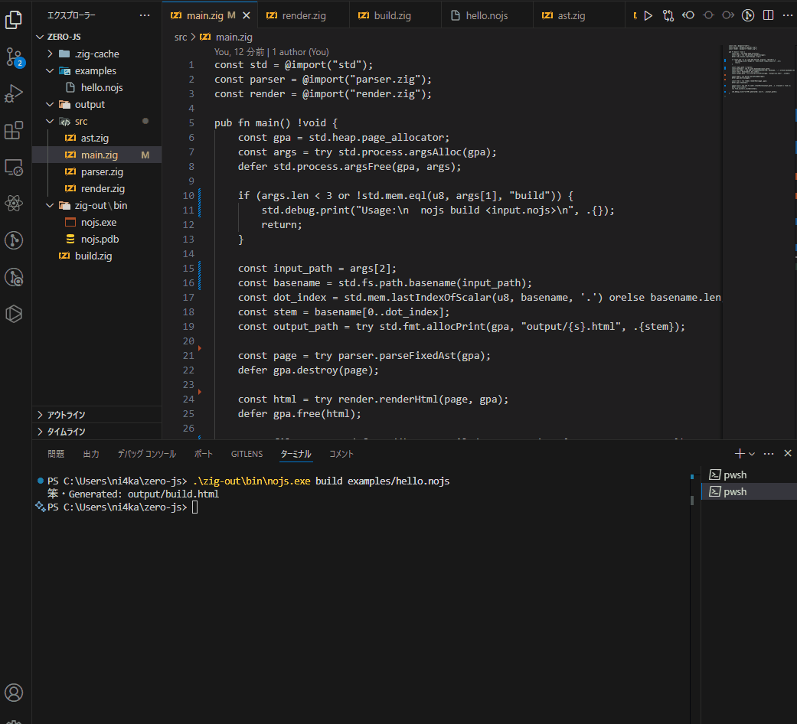

# NO JS – Build the Web Without JavaScript



**NO JS** is a brand new *syntax operating system* that lets you build full HTML web apps using a minimal, meaning-driven grammar — with **zero JavaScript**.

Write your app like this:

```nojs
page "home" {
  state.username = "Yuki"
  div {
    h1 { text "Welcome, {username}" }
  }
}
```

Then run:

```bash
nojs build examples/hello.nojs
```

Get this:

```html
<div><h1>Welcome, Yuki</h1></div>
```

No JavaScript. No JSX. No build tools.  
Just pure structure, compiled from meaning.

---

## ✨ What is NO JS?

> A Syntax OS to build the Web using pure meaning.  
> No framework. No runtime. No JavaScript.

- Define state, UI, and structure using a declarative `.nojs` syntax
- Compile to pure static HTML (WASM later)
- Powered by Zig — fast, minimal, and JS-free
- Ideal for LLMs, beginners, educators, and indie builders

---

## 💡 Why Is This Revolutionary?

| Before NO JS | With NO JS |
|--------------|------------|
| useState, JSX, VDOM | `state.username = "Yuki"` |
| Framework boilerplate | Just describe what the app **means** |
| JavaScript everywhere | **No JS at all** |
| Complex tooling | One `.nojs` file + `nojs build` |

> NO JS replaces **imperative complexity** with **semantic clarity**.  
> It's not how you build — it's what you mean.

---

## 🧪 MVP Status (v0.1)

- ✅ `state` declarations
- ✅ Element structure (`div`, `h1`, `p`)
- ✅ Text nodes and `{}` placeholders
- ✅ CLI build: `.nojs` → `.html`
- ✅ Fully JS-free output

---

## 🚀 Installation

Download the latest release from GitHub:

🔽 [Download nojs-v0.1.zip](https://github.com/jetscript-lang/No-JS/releases)

1. Unzip the file
2. Open your terminal (PowerShell or CMD)
3. Run:

```bash
nojs.exe build examples/hello.nojs

---

## 📁 Project Structure

```
nojs/
├── src/
│   ├── main.zig       # CLI entry
│   ├── parser.zig     # Syntax → AST
│   ├── ast.zig        # AST node definitions
│   └── render.zig     # AST → HTML
├── examples/
│   └── hello.nojs     # Sample app
├── output/
│   └── hello.html     # Generated result
├── build.zig          # Build config
└── README.md
```

---

## 🧠 Who is this for?

| User Type | Why They Care |
|-----------|----------------|
| Indie Hackers | Single-file apps, no boilerplate |
| Educators | Meaning-first syntax for beginners |
| LLM Users | Easily parseable structure |
| Web Idealists | JS-free web stack believers |

---

## 🗺️ Roadmap

- [ ] `@click`, `if`, `each` expressions
- [ ] Components / slots
- [ ] `fetch` / `stream` support
- [ ] Playground: `nojs.dev`
- [ ] Syntax-to-WASM runtime
- [ ] Syntax App Store

---

## 🧙 Philosophy

> Code tells machines what to do.  
> **Syntax tells the world what you mean.**

NO JS is not a framework. It’s a new way of writing the web — one where **meaning is the only thing you write**, and the machine takes care of the rest.

---

## 🧵 Follow the Journey

- Twitter/X: [@yourhandle](https://twitter.com/yourhandle)
- Dev.to: [Your profile](https://dev.to/yourprofile)
- Show HN: *Coming Soon...*

---

## ⭐ Give It a Star

If you believe the web deserves to be simpler, declarative, and JS-free —  
**[⭐ Star this repo](#)** to support the movement.

---

## 📄 License

MIT © 2024 Your Name

---

## 🧩 Contributing

Want to add new syntax or build the playground?  
PRs and ideas are welcome. This is just the beginning of the NO JS syntax movement.
